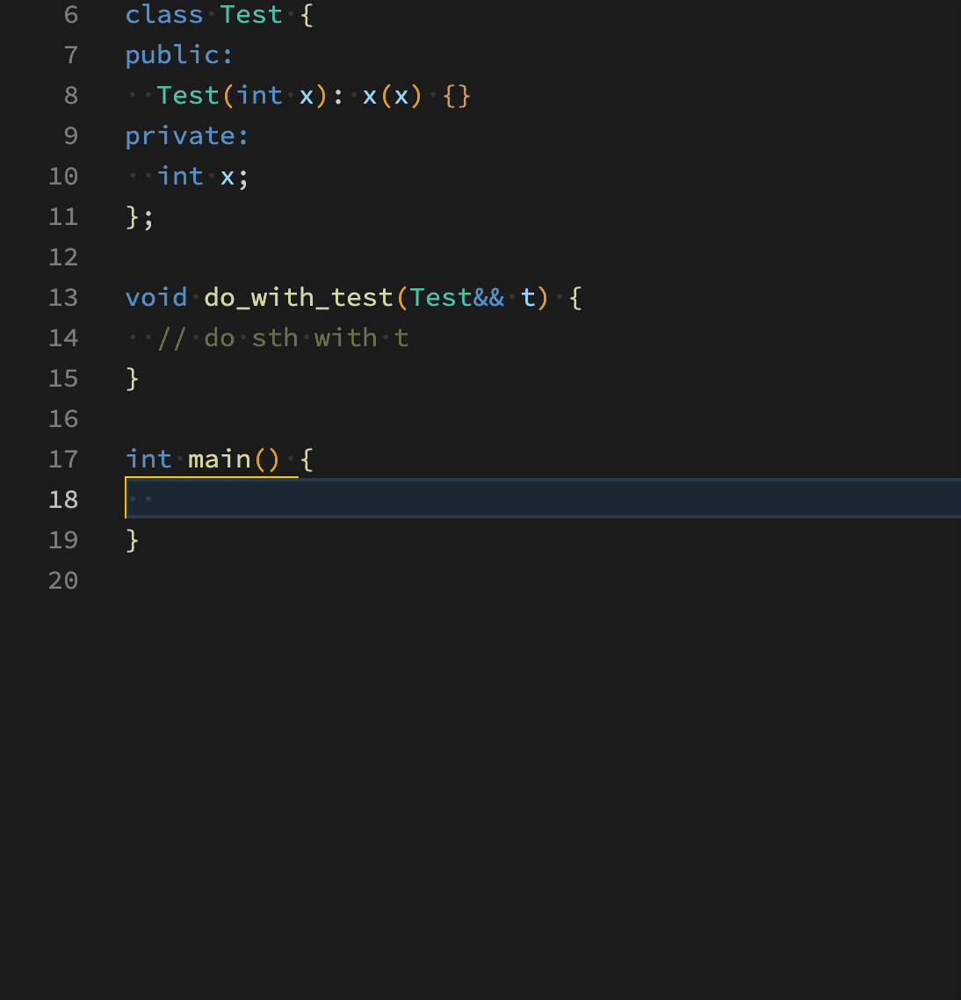

# C++ Postfix for VSCode

This repo is derived from [vscode-postfix-completion](https://github.com/gorpher/vscode-postfix-completion) which supports TypeScript/JavaScript/GO/Rust/More very well. If you work with these languages, it's for you too.

Add support for C++, and support word and whole line substitution.

## Features
- secondary development builds its own postfix template.
- support for custom configuration.
- support substitute current word or current line



## Builtin Postfixes
Builtin postfixes:

```json
[
  {
    "name": "fori",
    "description": "",
    "body": "for (auto i = 0; i < {{expr}}; i++) {\n{{indent}}$0\n}",
    "mode": "line"
  },
  {
    "name": "for_each",
    "description": "",
    "body": "for (auto&$1 $2 : {{expr}}) {\n{{indent}}$0\n}",
    "mode": "word"
  },
  {
    "name": "if",
    "description": "",
    "body": "if ({{expr}}) {\n{{indent}}$0\n}",
    "mode": "line"
  },
  {
    "name": "not",
    "description": "",
    "body": "!{{expr}}",
    "mode": "word"
  },
  {
    "name": "return",
    "description": "",
    "body": "return {{expr}};",
    "mode": "line"
  },
  {
    "name": "auto",
    "description": "",
    "body": "auto $1 = {{expr}}$0",
    "mode": "line"
  },
  {
    "name": "var",
    "description": "",
    "body": "$1 $2 = {{expr}}$0",
    "mode": "line"
  },
  {
    "name": "sharedptr",
    "description": "",
    "body": "std::shared_ptr<{{expr}}>$0",
    "mode": "word"
  },
  {
    "name": "uniqueptr",
    "description": "",
    "body": "std::unique_ptr<{{expr}}>$0",
    "mode": "word"
  },
  {
    "name": "weakptr",
    "description": "",
    "body": "std::weak_ptr<{{expr}}>$0",
    "mode": "word"
  },
  {
    "name": "makeshared",
    "description": "",
    "body": "std::make_shared<{{expr}}>($1)$0",
    "mode": "word"
  },
  {
    "name": "makeunique",
    "description": "",
    "body": "std::make_unique<{{expr}}>($1)$0",
    "mode": "word"
  },
  {
    "name": "move",
    "description": "",
    "body": "std::move({{expr}})",
    "mode": "word"
  },
  {
    "name": "forward",
    "description": "",
    "body": "std::forward<$1>({{expr}})$0",
    "mode": "word"
  },
  {
    "name": "vector",
    "description": "",
    "body": "std::vector<{{expr}}>$0",
    "mode": "word"
  },
  {
    "name": "map",
    "description": "",
    "body": "std::map<{{expr}}>$0",
    "mode": "word"
  },
  {
    "name": "set",
    "description": "",
    "body": "std::set<{{expr}}>$0",
    "mode": "word"
  },
  {
    "name": "unordmap",
    "description": "",
    "body": "std::unordered_map<{{expr}}>$0",
    "mode": "word"
  },
  {
    "name": "unordset",
    "description": "",
    "body": "std::unordered_set<{{expr}}>$0",
    "mode": "word"
  },
  {
    "name": "cast(static)",
    "description": "static_cast",
    "body": "static_cast<$1>({{expr}})$0",
    "mode": "word"
  },
  {
    "name": "cast(reinterpret)",
    "description": "reinterpret_cast",
    "body": "reinterpret_cast<$1>({{expr}})$0",
    "mode": "word"
  },
  {
    "name": "std",
    "description": "Add std namespace",
    "body": "std::{{expr}}",
    "mode": "word"
  }
]
```

## Custom your own postfix
**PR is welcome 😄**

Extension Settings like this in setting.json or setting in VS Code:

```json
   "postfix_cpp.templates": [
      { // declare an auto variable
         "name": "auto",
         "description": "auto variable",
         "body": "auto $1 = {{expr}}$0",
         "mode": "line",
      },
      { // define a shared ptr
         "name": "sharedptr",
         "description": "declare sharedptr of some type",
         "body": "std::shared_ptr<{{expr}}> $1",
         "mode": "word",
      }
   ],
```

Note:
1. {{expr}} is a placeholder for the current line or current word to be substituted
2. $1 will be the first cursor position, $2 second cursor position, etc. $0 is the final cursor position.
3. mode could be "line" or "word", default value is "line". "line" means current line will be substituted, "word" means current word will be substituted.


## Developer
### Run or debug

```bash
# step 1. clone the code, to local directory, ~/Code/extension for example.
git clone current_url ~/Code/extension
# step 2: install yarn and all the dependencies
cd ~/Code/extension
# install yarn
npm install -g yarn
# install dependencies
yarn install
```

### Package


```bash
cd ~/Code/extension
# step 1. install vsce (VisualStudio Code Extensions)
npm install -g @vscode/vsce
# step 2. packaging
vsce package
# and if no error, a file with .vsix entension under current direcotry will be created, such as:
# vscode-postfix-completion-0.0.1.vsix
```

### Install vsix Version
Click "Extensions" in Sidebar, and click the horizental triple dots, choose "Install from VSIX...", choose the vsix file generated in previous step.

For more details: [Publishing Extensions](https://code.visualstudio.com/api/working-with-extensions/publishing-extension).

## TODO

* [ ] 'word' mode is weak now, and not so good. In the future, recognize C++ expression/statements accurately via communicating with clangd.

## Release Notes

### 0.0.1
replace the line expression text.
